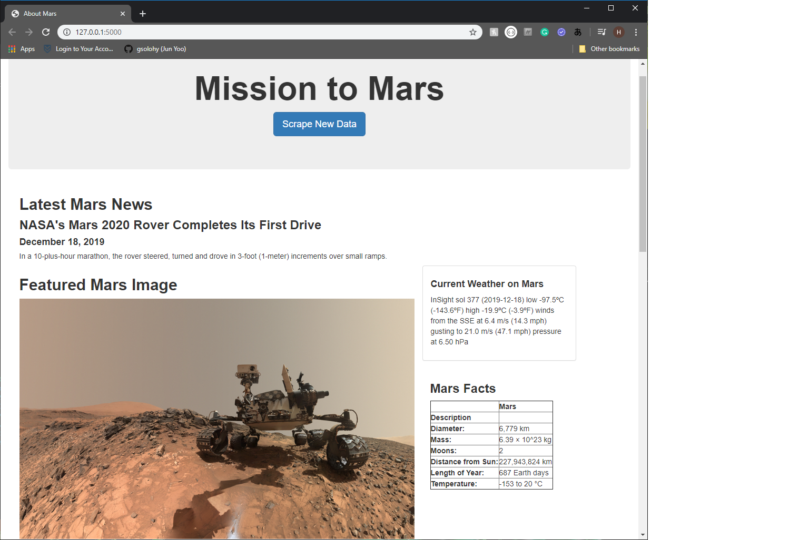
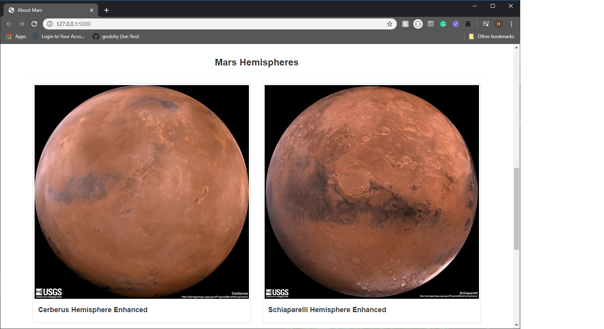
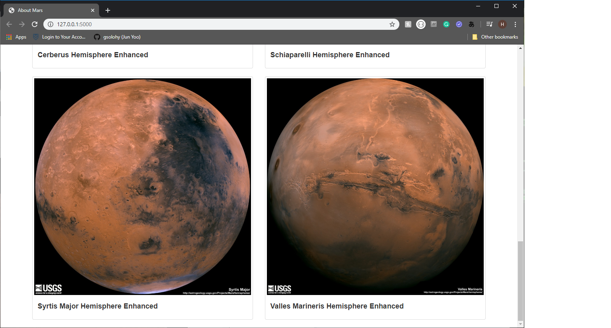

# web-scraping-challenge

## Webscraping and Mongo Homework - Mission to Mars
* Due on Thursday: December 19, 2019

### Task: In this assignment, you will build a web application that scrapes various websites for data related to the Mission to Mars and displays the information in a single HTML page. The following outlines what you need to do.

1. Scraping - mission_to_mars.ipynb
2. MongoDB and Flask Application - scrape_mars.py & app.py & templates/index.html
3. App Screenshots

